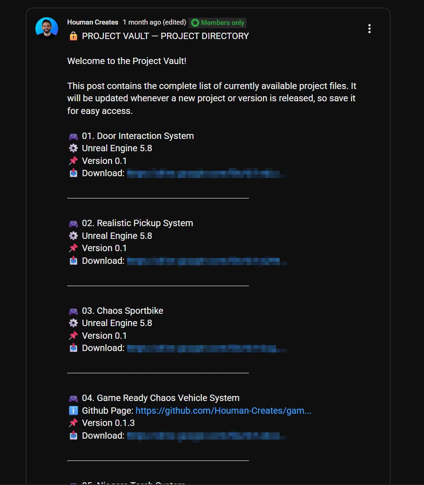

# Houman Creates — Project Vault

This page lists the Unreal Engine projects currently available to **Project Vault** members.

Project Vault members will receive access to all eligible tutorial projects as they are added, including new projects created for future tutorials. Download links are shared through members-only YouTube posts.

## Available Projects

| Project                 | Engine Version | Related Tutorials                                        | Details & Updates                      |
| ----------------------- | -------------- | -------------------------------------------------------- | ----------------------------------- |
| Chaos Tank System | UE5.8 | [Whole Tank Series](https://youtube.com/playlist?list=PLDtMN4Kd2xg8&si=vQYqPP8FapLPWblm) |  Updated through the latest tutorial | 
| Door Interaction System | UE5.8 | [Build Better Doors in Unreal Engine 5](https://youtu.be/CR8Qy6dmCAU) | Updated through the latest tutorial |
| Realistic Pickup System | UE5.8         | [Core System](https://youtu.be/W856GJgqM2U) · [Polishing & New Features](https://youtu.be/6zGQFsnKCeY) · [Item Inspection](https://youtu.be/OWD3cMA5EV0) | Updated through the latest tutorial |
| Chaos Sportbike | UE5.8 | [Whole Sportbike Series](https://www.youtube.com/playlist?list=PLBt62vuzWb-8) | Updated through the latest tutorial |
| Game Ready Vehicle System | UE5.8 | [Whole Vehicle Series](https://www.youtube.com/playlist?list=PLZ4gVJKjt3LRH_bHOaDgLuu-FMYLKBfOy) |  [Project Details & Changelog](https://github.com/Houman-Creates/game-ready-vehicle-system) |
| Niagara Torch System | UE5.8 | [Whole Torch Series](https://www.youtube.com/playlist?list=PLZ4gVJKjt3LQ3T3gySTCX7KlQta-gD9XV) | Updated through the latest tutorial |
| Robot Arm | UE5.8 | [Whole Robot Arm Series](https://www.youtube.com/playlist?list=PLZ4gVJKjt3LQ3T3gySTCX7KlQta-gD9XV) | Updated through the latest tutorial |
| Telekinesis System | UE5.8 | [Build a Telekinesis System in UE5](https://youtu.be/9YBTTCOwFuM) | Updated through the latest tutorial |
| Turn In Place (Root Motion) | UE5.8 | [Turn In Place Root Motion](https://youtu.be/KtQoM_QtCmw) | Updated through the latest tutorial |
| TV Main Menu | UE5.8 | [Interactive Horror Menu](https://youtu.be/CDf-5lp4yxQ) | Updated through the latest tutorial |
| Character Locomotion | UE5.8 | [Character Movement Animations](https://youtu.be/CAT-zL5n8lk) |  Updated through the latest tutorial |

The **Related Tutorials** column shows which videos and follow-up tutorials are included in each project. More projects will be added gradually.

## Links

🎬 [Houman Creates on YouTube](https://www.youtube.com/@HoumanCreates)

🔒 [Join the Project Vault Membership](https://www.youtube.com/channel/UCB1r8NTUASWOScq7CLjJ32Q/join)

## 🔐 HOW TO ACCESS THE PROJECT VAULT DOWNLOADS

After becoming a Project Vault member:

1. Go to my YouTube channel.
2. Open the **Posts** tab.
3. Scroll down until you find the members-only post titled:

🔒 **PROJECT VAULT — PROJECT DIRECTORY**

This post contains the download links for every available project. It is updated whenever a new project or version is released, so you can always return to the same post.

Please check the attached image to see exactly what the post looks like.

## 📜 Project Vault License

Project Vault files are provided exclusively to **Houman Creates – Project Vault members**.

### Permitted Use

You may:

* Use and modify these files in personal or commercial projects.
* Use the included systems in games, videos, demos, and portfolio work.

You may not:

* Resell, redistribute, share, or publicly upload the original files.
* Share the private download links with anyone else.
* Include the files in asset packs, templates, courses, or other downloadable projects.
* Claim the included systems, rigs, or custom animations as your own work.

### Asset Ownership and Credits

All third-party 3D models and assets are properly credited. Full ownership of these assets remains with their original creators, and Houman Creates does not claim ownership of them. Their use remains subject to the licenses provided by their respective creators.

My contribution is the rigging, Unreal Engine implementation, gameplay systems, Blueprints, and custom-made animations. These original elements are created and owned by **Houman Creates** and are provided under this Project Vault license.

Membership grants permission to use these files under the terms above—it does not transfer ownership or grant permission to redistribute them.

© Houman Creates. All rights reserved.
